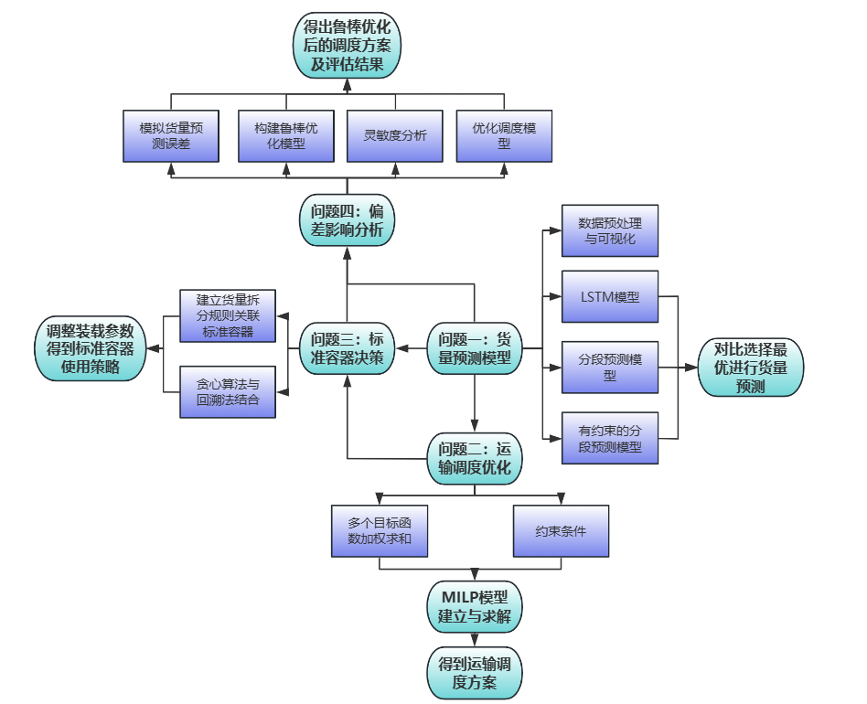
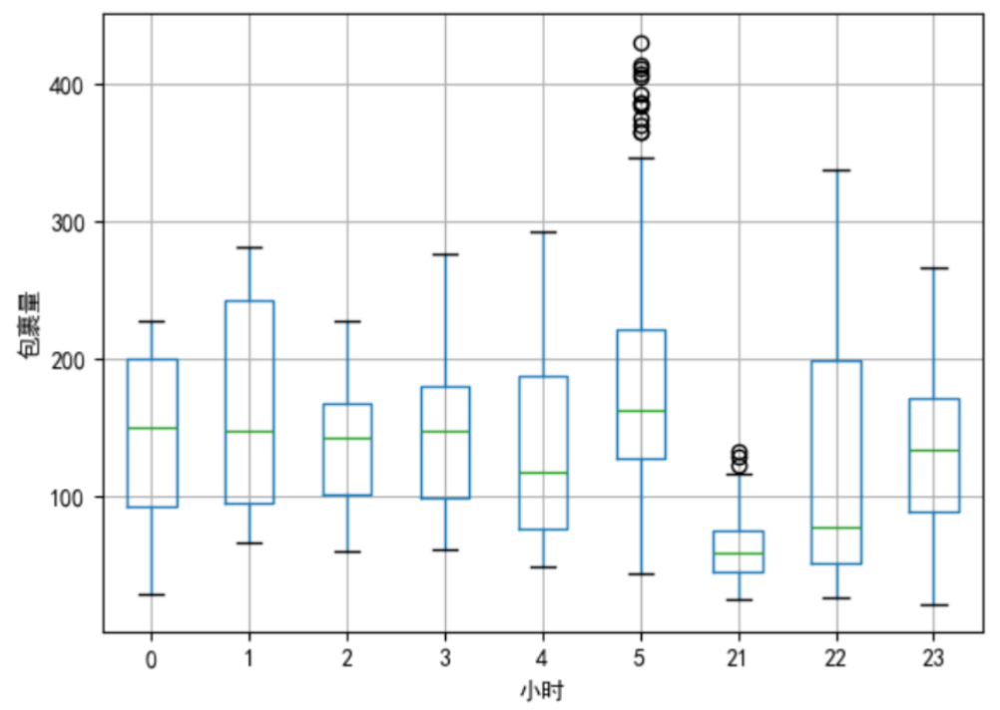
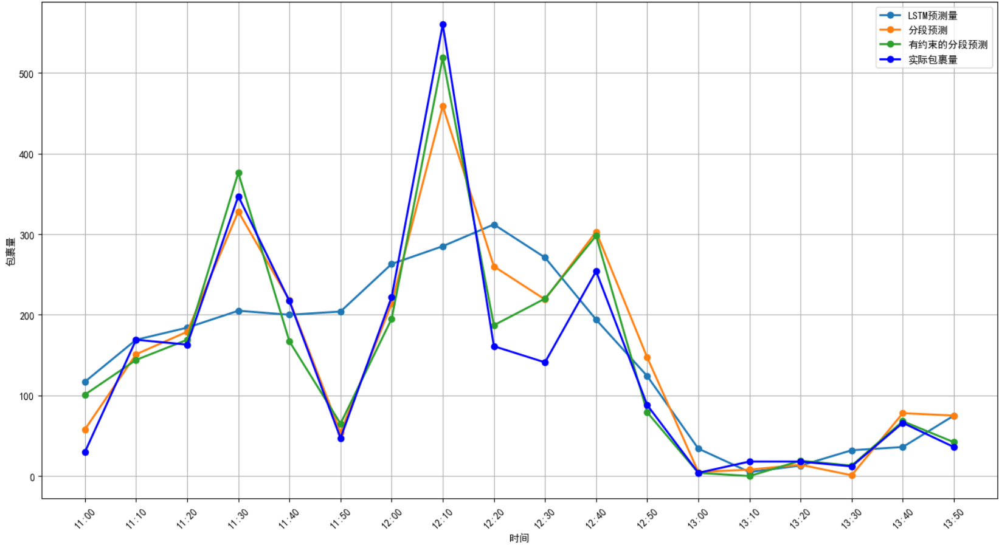

# 基于约束分段预测模型的货量运输优化调度

## 技术栈
Pandas / NumPy / Scikit-learn / Matplotlib / LSTM

## 🏆 项目成果
- 竞赛奖项：2025年 MathorCup 数学建模竞赛 赛区二等奖
- 核心成果：针对物流短途运输的货量预测与车辆调度问题，搭建了「时序预测-多目标优化-动态调度-鲁棒性验证」全流程模型，实现预测模型RMSE从99.70降至34.21，15%预测误差下运输成本超支降低13%，自有车辆周转率提升至85%。

## 📋 问题背景与重述
短途物流运输是电商履约的核心末端环节，核心痛点在于**货量预测不准导致运力资源浪费、运输成本高企**。本次竞赛需解决4个核心问题：
1.  基于15天10分钟颗粒度的历史货量数据，预测未来1天各线路货量，并拆解到10分钟粒度；
2.  基于预测货量，以「自有车周转率最高、单车装载率最高、总成本最低」为目标，构建多目标运输调度优化模型；
3.  引入标准容器，在装卸效率与装载量之间做权衡，优化容器使用策略与调度方案；
4.  分析货量预测误差对调度方案的影响，提升模型的鲁棒性与抗扰动能力。

## 🧠 核心模型与思路

### 一：有约束的分段LSTM货量预测模型
针对物流货量的强周期性、时段性波动特征，创新性提出**带连续性约束的分段LSTM预测模型**：
1.  数据预处理：
- 使用Pandas库读取附件提供的Excel文件，获取15天各线路的包裹量数据。
- 将货量列转换为数值类型，并进行数据清洗。
- 使用Matplotlib绘制部分线路的散点图和折线图，观察数据分布，进行数据划分。
2.  差异化建模：为不同时段/波峰波谷段训练独立的LSTM子模型，捕捉局部时序特征；
3.  约束优化：添加时段交界处的连续性约束，解决分段预测的突变问题，实现预测数据平滑衔接；
4.  模型效果：相比原生LSTM，相关系数R从0.7035提升至0.9706，RMSE从99.70降至34.21，预测精度大幅提升。

### 二：多目标混合整数线性规划（MILP）调度模型
将「周转率、装载率、成本」三个冲突的多目标，通过加权法转化为单目标优化问题：
1.  决策变量：定义车辆-任务分配二元变量、外部承运二元变量；
2.  约束条件：通过大M法将时间衔接、发运节点、串点合并（≤3条线路）、车辆数量等约束线性化；
3.  模型求解：通过Python实现MILP求解，实现自有车周转率85%，低货量线路串点合并节约23%运输成本。

### 三：基于贪心+回溯的标准容器动态调度策略
针对标准容器「装卸时间缩短、装载量下降」的权衡问题，构建动态决策模型：
1.  决策规则：引入容器使用二元变量，建立货量拆分规则关联装载量与装卸时长；
2.  求解算法：先用贪心算法做局部最优决策，再通过回溯法修正全局次优解，避免陷入局部最优；
3.  优化效果：容器使用使单车作业效率提升42%，外部车辆使用次数显著减少，整体运输成本下降。

### 四：鲁棒性优化与灵敏度分析
针对现实中货量预测的不确定性，完成模型的抗扰动优化：
1.  扰动模拟：对预测货量加入±5%~±20%的随机扰动，模拟现实预测误差；
2.  灵敏度分析：量化预测误差对总成本、周转率、装载率的影响程度，识别模型敏感参数；
3.  动态优化：引入基于PPO算法的动态调整机制，在15%预测误差水平下，相比静态调度降低13%的成本超支，方案失效概率从38%降至12%。

## 💻 代码结构与运行说明
### 代码文件说明
| 文件名 | 核心功能 |
|--------|----------|
| q1_货量预测模型.py | 数据预处理、原生LSTM、分段LSTM、有约束分段LSTM模型实现与预测可视化 |
| q2_运输调度优化模型.py | 多目标MILP模型构建、任务生成、串点合并、车辆调度求解 |
| q3_标准容器调度优化.py | 容器使用决策、贪心+回溯算法实现、容器化调度优化 |
| q4_鲁棒性与灵敏度分析.py | 预测误差扰动模拟、灵敏度分析、鲁棒性评估、动态优化机制 |

### 运行环境
- Python 3.9及以上版本
- 依赖安装：在代码目录下执行 `pip install -r requirements.txt` 即可一键安装所有依赖包
- 运行方式：按问题顺序依次运行对应py文件，即可复现论文所有结果与图表

## 📊 核心结果展示
###  可视化分析

*通过可视化分析发现，包裹量呈现明显的早晚班周期性波动*

###  预测模型效果对比

*上图为原生LSTM、分段LSTM、有约束分段LSTM三种模型的预测结果与真实值对比，有约束分段模型对高峰段的预测精度提升最为显著。*

### 3. 鲁棒性评估结果
| 扰动水平 | 方案失效概率 | 成本波动 | 周转率变化 |
|----------|--------------|----------|------------|
| 5%       | 4%           | ±0.4万元 | -3.4%      |
| 10%      | 12%          | ±0.8万元 | -6.2%      |
| 15%      | 23%          | ±1.3万元 | -9.8%      |
| 20%      | 38%          | ±2.1万元 | -15.7%     |

## 📎 完整资源
- [📄 竞赛完整论文](./01-论文原文/物流货量预测与运输调度优化.pdf)
- [📊 原始数据与结果表](./03-数据文件/)
- [📈 完整图表合集](./04-图表结果/)
